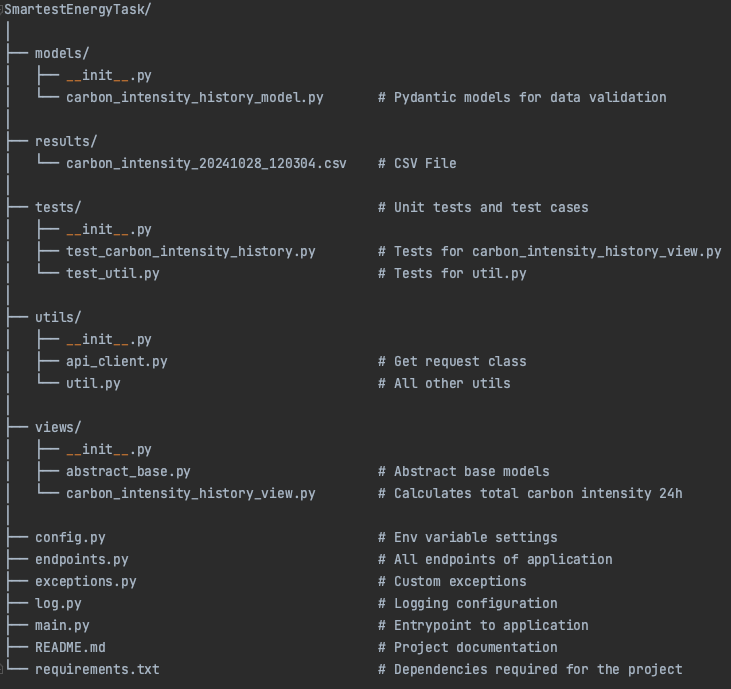

# SmartestEnergy

- PYTHON_VERSION: 3.11
- IDE: PyCharm

## Problem Statement
Calculate the known carbon intensity (in gCO2eq/kWh) of electricity consumed in the UK 
using the Electricity Maps API for the last 24 hours.

This information can be retrieved from https://docs.electricitymaps.com/#recent-carbon-intensity-history 
and will be displayed in a csv file.

## Structure of application


## Run Application
1. Create Virtual Environment ```python3.11 -m venv venv```. 
2. Then activate venv: ```source venv/bin/activate```
3. Install all the dependencies ```pip install -r requirements.txt```
4. Create '.env' file in root folder and add env variables e.g. 
    ```
    LOGGING_LEVEL=<currently_set_to_DEBUG>
    ```
5. Run the application```python main.py```
6. Check the 'results' folder where .csv file is stored with date and time.

## Test Application
1. Run ```pytest``` in CLI
